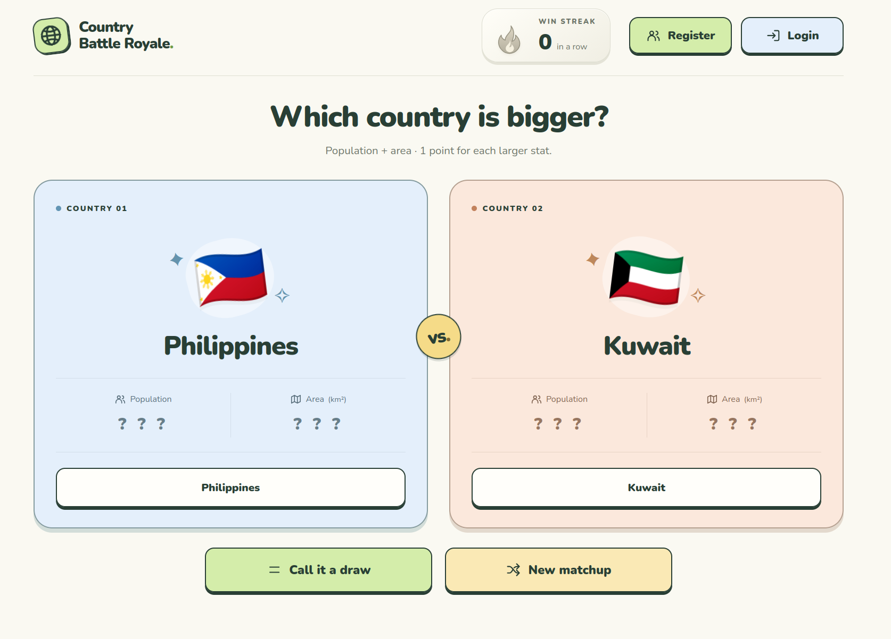

# Country Battle Royale

A small Flask game where you guess which of two random countries wins on population and area. Built with Python, Jinja2, HTML, CSS, and JavaScript, using the REST Countries API.



## How to play

- Larger population earns **1 point**; larger area earns **1 point**.
- Pick the country with the higher score, or **Call it a draw** if the scores match.
- Correct guesses build your win streak. An incorrect guess resets it.
- After answering, choose **New matchup** to play another round.

## Run locally

Use **Python 3.12+** and run these commands from the project root:

```bash
python3 -m venv .venv
source .venv/bin/activate
python -m pip install -r requirements.txt
cp .env.example .env
```

On Windows PowerShell, activate with `.venv\Scripts\Activate.ps1` and copy `.env.example` to `.env` manually.

In `.env`, set `MY_SECRET_KEY` to your REST Countries v5 API key. Generate a Flask session secret:

```bash
python -c "import secrets; print(secrets.token_hex(32))"
```

Paste the **output** into `FLASK_SECRET_KEY` in `.env`. Keep `.env` out of Git.

Start the app:

```bash
python -m flask --app backend.app run --debug
```

Open [localhost:5000](http://127.0.0.1:5000). Country data is cached for seven days; downloading or refreshing it requires an internet connection and a valid API key.

## Account features

Registration works with PostgreSQL, Argon2 password hashing, and inline errors for duplicate usernames or emails. Requires `DATABASE_URL` and a configured `users` table. Login is not implemented yet.

## Tests

```bash
python -m unittest tests -v
```

The test uses the game's country cache and needs API access if the cache is missing or expired.

[MIT license](LICENSE) · [Font license](static/fonts/OFL.txt)
